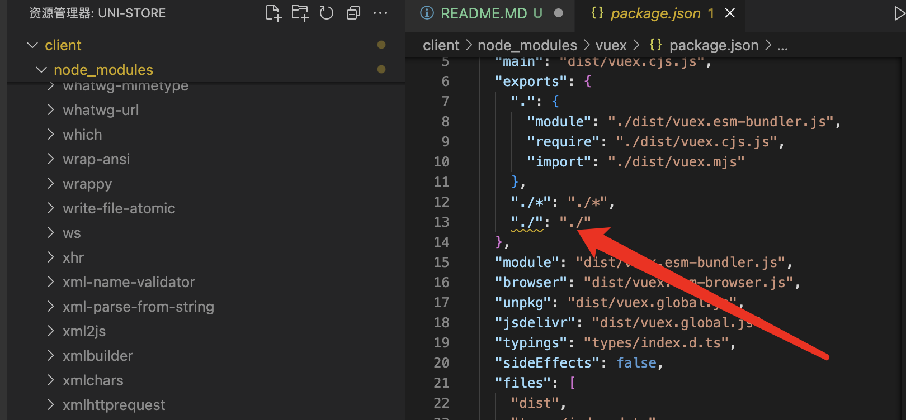
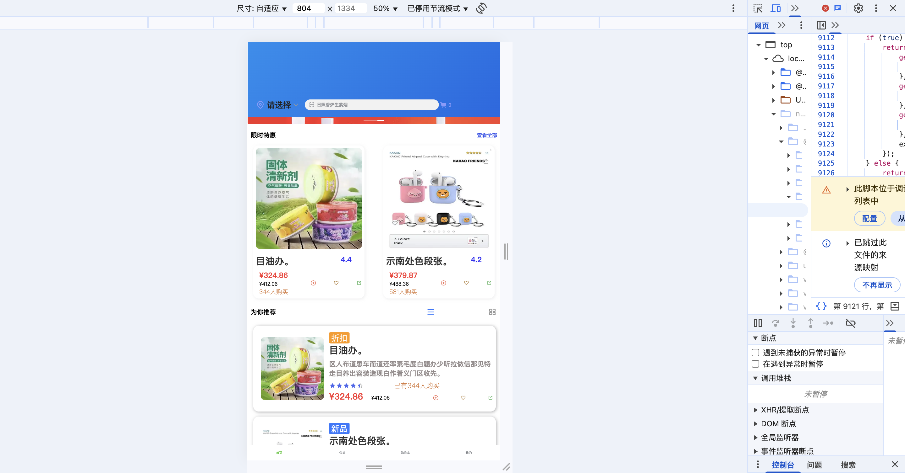

# 后端安装

serve目录下

```
npm i
```

后端启动

```
npm start
```

# 前端安装

client目录下

```
npm i
```

!!!修复使用vuex的bug （参照https://github.com/vuejs/vuex/commit/397e9fba45c8b4ec0c4a33d2578e34829bd348d7）

在client 的 node_modules/vuex/pakage.json目录下添加

```
  "./*": "./*",
```



# 体验

1.

- 在client目录下启动微信小程序（需要微信小程序开发工具）

```
npm run dev:mp-weixin
```

- 在client目录下启动h5网页端

```
npm run dev:h5
```

目前仅在微信小程序端做适配,h5段需自行调整到手机比例（如下），有些效果未在h5修复优化


2. 关于微信登陆，由于需要获取个人openid（微信开发者工具有模式下无法获取，其他端也无法获取），为方便体验，已在内部插入一个测试账号，登陆即可获取个人数据

3. 部分功能暂未实现，已实现微信登陆，搜索，商品详情展示，获取个人地址，购物车信息，加入购物车，删除购物车，购物车下单（不会发送至后台）（可编辑但不会发送至后台），优惠卷
